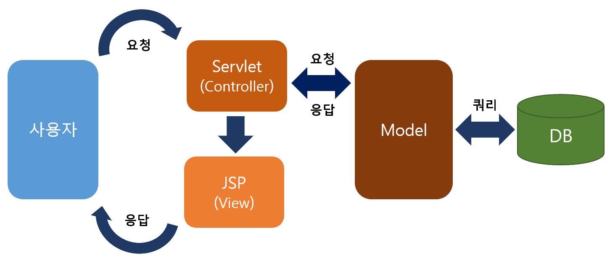

# java-springboot-2025
2025년 부경대 Java 개발자 과정 SpringBoot 리포지토리

## 1일차(04-01)

## 웹 개요
- 구성 3단계
    - 브라우저(클라이언트/프론트엔드) - 사용자가 **요청**을 하고, 결과를 돌려받는 파트
    - 서버(백엔드) - 사용자의 요청을 받아 DB에서 데이터를 가져와 처리하고, 사용자에게 **응답**하는 파트
    - 데이터베이스 - 가장 중요한 데이터가 저장되어 있는 파트
- 웹 개념
    - Request(요청)에 대한 Response(응답)

## Spring Boot 개요
- Java - 컴퓨팅 세상 모든 곳에서 사용될 수 있는 언어가 되고자 개발됨
- 웹개발
    1. CGI(Common GateWay Interface) - HTTP 프로토콜에서 정적인 데이터만 전달할 수 있는 웹기술(자바 웹기술은 아니고 그냥 웹기술임)
    2. Servlet - CGI를 개선한 Java 웹 기술. 동적웹을 개발할 수 있음
        - HTML 코드를 전부 다 Java에서 작성해야 함
    3. EJB(Enterprise Java Bean) - 서블릿으로 대형 프로젝트를 개발할 수 있는 Java 웹기술
        - 무지하게 복잡!
    4. JSP(Java Server Page) - 웹페이지코드(HTML)에 자바소스를 포함시켜 개발할 수 있는 Java 웹기술
        - 확장자가 .Jsp / 스파게티 코드가 되기 쉬움
    5. Spring - Java웹개발의 중심이였던 시기가 있었음(전성기). 웹페이지와 자바 영역 분리리
        - 설정이 복잡
    6. Spring Boot - Spring의 단점을 최소화. 설정을 간결화

- Spring Boot
    - https://spring.io/pro
    - Spring 기술을 그대로 사용(마이그레이션이 간단)
    - JPA 기술을 사용하면 ERD나 DB설계를 하지 않고도 손쉽게 DB를 생성
    - Tomcat Webserver가 내장!(설치 필요없음)
    - 서포트하는 기능 다수 존재(개발을 쉽게 도와줌)
    - 테스트용 JUnit ,로그용 Log4J2 모두 포함(설치 필요없음)
    - 프론트엔드를 다양하게 지원. JSP, **Thymeleaf**, Mustache 등
    - MVC(Model View Controller)로 영역을 분리. 각 부분별로 따로 개발

- MVC
    - View는 JSP포함, Thymeleaf, Mustach, HTML 등등
    

## Spring Boot 개발환경 설정
- 필수요소
    - Java, 개발툴, 데이터베이스

- Java
    - Java Runtime과 JDK(Java Developer Kit) 존재
        - Oracle 외에도 OpenJDK가 산재
        - https://www.azul.com/downloads/?package=jdk#zulu
        - https://adoptium.net/
        - https://jdk.java.net/
    - Java 17버전 이상 설치
    - https://www.oracle.com/kr/java/technologies/downloads/
    - jdk-17.0.13_windows-x64_bin.msi 다운로드

    - 시스템정보(sysdm.cpl) 고급 > 환경변수 > PATH 설정
        - 새로만들기
            - JAVA_HOME + 본인경로 입력
        - path에 %JAVA_HOME%\bin 추가, 맨 위로
    - powershell
        - java --version으로 확인

- Visual Studio code 확장 설치
    - Java 검색
        - Extension Pack for Java 설치. Debugger for Java등 총 7가지 확장 설치

### Java 기본 실행
- VS Code에서 명령팔레트 실행(ctrl + shift + p)
    - Java create Java Project... 엔터
        1. build tool: Maven 엔터
        2. No ArchType 선택
        3. Group ID 입력(com.example)
        4. Artifact ID 입력(demo)
        5. 저장위치 결정

### Spring Boot 설정
- Visual Studio Code 확장 설치
    - Spring 검색
        - Spring Initiaizr Java Support 설치(추가 3개 확장 같이 설치됨)
    - Gradle(빌드툴) 검색
        - Gradle for Java 설치

### Spring Boot 기본 실행(Java 프로젝트)
- VS Code에서 명령팔레트 실행
    - Spring Initiaizr: Create a Maven Project
    - Specify Spring Boot version: 3.3.10 선택
    - Specify project language: Java
    - Input Group ID: 본인 아이디 입력 / com.yb83
    - Input Artifact ID: spring01 엔터
    - Specify packaging type: Jar(Java archive, 압축파일일)
    - Spectify Java version: 17 선택
    - Choose Dependencied: Selected 0 dependencies 
    - 저장 위치 선택 후 오른쪽 하단에 open 클릭하면 설치됨
    - **새 창 열기** Spring Boot 프로젝트가 루트폴더가 된 개발환경

- 실행방법
    - 코드작성
    - Spring Boot Dashboard > Apps > 앱 실행

- 기초문법
    - [JAVA기초문법](./JAVA_BASIC.md)

- 반복문 : for문, while문, do-whele문

	- for문 - 대표적인 반복문

	```java	
	// 일반적인 반복문
	for (초기값; 조건식; 증감식) {
        실행코드 블럭;
    }

    // 배열, 컬렉션을 처리하는 반복문
    for (변수 : 컬렉션데이터) {
        실행코드 블럭;
    }
    ```
    - while문 - 조건식이 참인동안 계속 반복
    ```java
    while(조건식) {
        실행코드 블럭;
    }
    ```

    - do-while문 - 우선 실행코드를 한번 수행 후 조건을 검사 후 반복

    ```java
    do {
        실행코드 블럭;
    } while(조건식);
    ```

- 반복제어 키워드 : break, continue
    - for문, while문 내에서 사용
    - break - 조건에 맞아 반복문을 탈출할 때
    - continue - 특수 조건만 비켜서 반복문을 계속할 때


## 2일차

## 3일차

## 4일차

## 5일차

## 6일차(06-26)